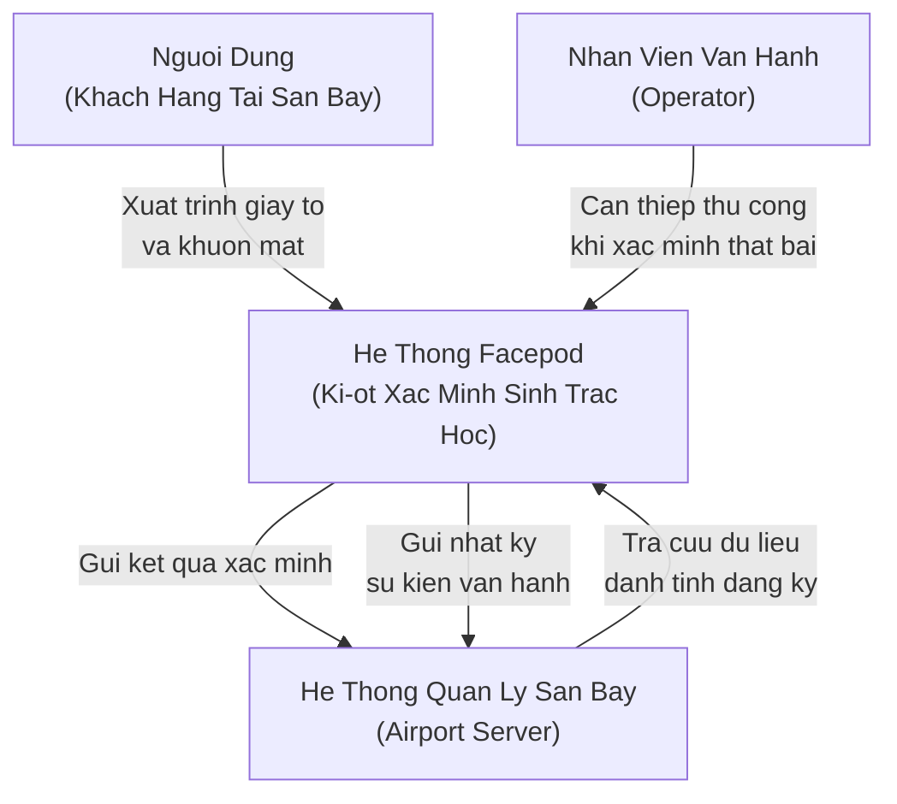

# C4 Level 1 — Ngu Canh He Thong (System Context)

## Muc Dich

Cap do nay trinh bay vi tri cua He thong Facepod trong moi truong van hanh thuc te tai san bay. Khong de cap den cong nghe cu the hoac ma nguon. Chi tap trung vao cac thuc the ben ngoai tuong tac voi he thong.

## Mo Ta Ngu Canh

He thong Facepod hoat dong nhu mot ki-ot xac minh danh tinh sinh trac hoc (biometric verification kiosk) duoc dat tai cac diem kiem soat san bay. Nguoi dung (khach hang) tiep can ki-ot, xuat trinh giay to tuy than, va duoc xac minh khuon mat tu dong. Ket qua xac minh duoc truyen ve He thong Quan ly San bay (Airport Server) de cap nhat trang thai thong hanh.

Trong truong hop xac minh that bai hoac xay ra loi phan cung, nhan vien van hanh (operator) co kha nang can thiep thu cong thong qua giao dien dieu khien tren PC Gateway.

## So Do Ngu Canh

## Cac Thuc The Chinh

| Thuc The | Vai Tro |
|---|---|
| Nguoi Dung (Khach Hang) | Doi tuong duoc xac minh danh tinh tai ki-ot. |
| He Thong Facepod | Thuc hien thu nhan hinh anh, suy luan NPU, va doi chieu sinh trac hoc. |
| He Thong Quan Ly San Bay | Luu tru co so du lieu danh tinh dang ky va tiep nhan ket qua xac minh. |
| Nhan Vien Van Hanh | Can thiep thu cong trong truong hop he thong khong the xac minh tu dong. |

