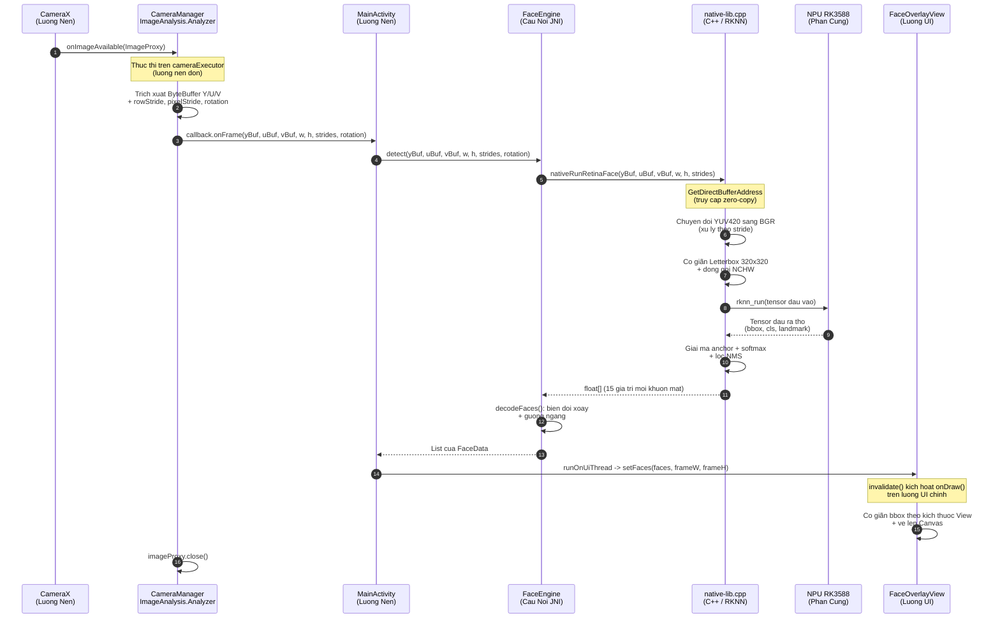

# C4 Level 3 — Thanh Phan Noi Bo (Components)

## Muc Dich

Cap do nay trinh bay kien truc noi bo cua Ung dung Android (`com.facepod`), lam ro ranh gioi giua tang Giao dien (UI), tang Tuong tac Phan cung (Hardware), va tang Giao tiep JNI (Native Bridge).

## Cau Truc Goi

```
com.facepod
├── FaceData.java                  // Doi tuong du lieu: toa do bbox, diem tin cay, landmark.
├── FaceOverlayView.java           // View tuy chinh: co giãn va ve ket qua phat hien len Canvas.
├── MainActivity.java              // Chu so huu vong doi: quyen, khoi tao engine, dieu phoi UI.
├── hardware/
│   └── CameraManager.java         // Dieu phoi CameraX: Preview + ImageAnalysis tren executor nen.
└── jni/
    └── FaceEngine.java            // Cau noi JNI: khai bao native, detect(), giai ma voi xoay/guong.

Tang Native:
app/src/main/cpp/
└── native-lib.cpp                 // Don vi dich C++: chuyen doi YUV-BGR, suy luan RKNN, NMS.
```

## Ranh Gioi Thanh Phan

### Tang Giao Dien (UI Layer)

- **MainActivity:** Quan ly vong doi Activity. Xu ly luong cap quyen camera. Khoi tao `FaceEngine` voi mo hinh RKNN. Nhan callback khung hinh tu `CameraManager` tren luong nen va dieu phoi ket qua sang luong UI qua `runOnUiThread()`.
- **FaceOverlayView:** View tuy chinh ke thua tu `View`. Nhan danh sach `FaceData` va kich thuoc khung hinh, co giãn toa do bbox theo kich thuoc View thuc te, va ve truc tiep len `Canvas` trong `onDraw()`.
- **FaceData:** Doi tuong du lieu thuan tuy (POJO). Chua toa do bbox (x1, y1, x2, y2), diem tin cay (score), va mang 10 gia tri landmark (5 diem x 2 toa do).

### Tang Tuong Tac Phan Cung (Hardware Layer)

- **CameraManager:** Cau hinh CameraX voi hai use-case: `Preview` (hien thi tren `PreviewView`) va `ImageAnalysis` (phan tich khung hinh). Analyzer chay tren `ExecutorService` don luong (luong nen). Trich xuat truc tiep cac `ByteBuffer` mat phang YUV tu `ImageProxy` va chuyen tiep qua callback `OnFrameCallback` ma khong sao chep du lieu.

### Tang Giao Tiep JNI (Native Bridge Layer)

- **FaceEngine:** Cau noi giua Java va C++. Tai thu vien native (`npufacerecognition`). Chuyen tiep cac tham chieu `ByteBuffer` truc tiep cung metadata stride sang ham `nativeRunRetinaFace()`. Nhan mang `float[]` tra ve tu C++ va giai ma thanh `List<FaceData>` voi phep bien doi xoay (0, 90, 270 do) va guong ngang (camera truoc).
- **native-lib.cpp:** Don vi dich C++ duy nhat. Chua toan bo logic: chuyen doi YUV sang BGR, co giãn Letterbox, suy luan RKNN tren NPU, giai ma anchor, softmax, va NMS.

## So Do Trinh Tu Thuc Thi



