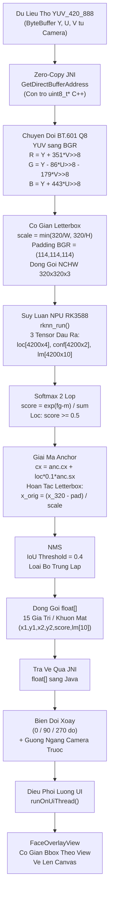

# C4 Level 4 — Ma Nguon va Thuat Toan (Code and Algorithm)

## Muc Dich

Cap do nay cung cap phan tich hop trang (white-box) ve cac thuat toan xu ly du lieu va co che quan ly bo nho trong duong ong suy luan. Moi giai doan bien doi du lieu duoc trinh bay voi cong thuc toan hoc cu the va tham chieu truc tiep den ma nguon.

---

## 1. Trich Xuat Bo Nho Zero-Copy

### Co Che

`CameraManager` trich xuat cac `ByteBuffer` truc tiep (direct buffer) tu `ImageProxy.PlaneProxy`. Cac buffer nay tro truc tiep den vung bo nho cua camera HAL, khong tao ban sao.

Tai ranh gioi JNI, ham `GetDirectBufferAddress()` cua JNI duoc su dung de lay con tro C++ (`uint8_t*`) tro den cung vung bo nho vat ly. Toan bo quy trinh tu camera den C++ dat duoc **zero-copy** — khong co thao tac sao chep du lieu nao xay ra.

### Cac Tham So Stride

| Tham So | Y Nghia |
|---|---|
| `yRowStride` | So byte giua hai dong lien tiep cua mat phang Y. |
| `uvRowStride` | So byte giua hai dong lien tiep cua mat phang U/V. |
| `uvPixelStride` | So byte giua hai mau U (hoac V) lien tiep tren cung mot dong. Gia tri 1 = planar, 2 = interleaved (NV12/NV21). |

---

## 2. Chuyen Doi YUV420 sang BGR

### Cong Thuc BT.601 Full Range (Fixed-Point Q8)

Voi Y, U, V la gia tri nguyen tu anh camera (U va V da tru 128):

```
R = Y + (351 * V) >> 8
G = Y - (86 * U) >> 8 - (179 * V) >> 8
B = Y + (443 * U) >> 8
```

Cac hang so `351, 86, 179, 443` la phien ban fixed-point Q8 cua he so BT.601:
- 351/256 = 1.371 (xap xi 1.402)
- 86/256 = 0.336 (xap xi 0.344)
- 179/256 = 0.699 (xap xi 0.714)
- 443/256 = 1.730 (xap xi 1.772)

Ket qua duoc clamp ve khoang [0, 255]. Thu tu ghi vao bo nho dau ra la B, G, R (dinh dang NCHW voi 3 mat phang rieng biet).

---

## 3. Co Gian Letterbox

### Cong Thuc

Muc dich: co giãn anh nguon (src_w x src_h) vao khung dich (320 x 320) ma giu nguyen ti le khung hinh, phan con lai duoc lap day bang mau dem (padding).

```
scale = min(320 / src_w, 320 / src_h)

scaled_w = (int)(src_w * scale)
scaled_h = (int)(src_h * scale)

pad_x = (320 - scaled_w) / 2      // le trai
pad_y = (320 - scaled_h) / 2      // le tren
```

- Vung anh thuc: pixel tai vi tri `(dx, dy)` trong khung 320x320 duoc anh xa nguoc ve anh goc theo: `sx = (int)((dx - pad_x) / scale)`, `sy = (int)((dy - pad_y) / scale)`.
- Vung padding: duoc lap day bang gia tri BGR = (114, 114, 114) — chuan YOLOv5/RetinaFace.
- Bang tra cuu (LUT) duoc tinh truoc cho tung cot va tung dong de toi uu hieu suat.

---

## 4. Sinh Anchor va Giai Ma RetinaFace

### Bang Cau Hinh Anchor

| Tang (Level) | Buoc (Step) | Kich Thuoc Feature Map | Kich Thuoc Anchor (pixel) |
|---|---|---|---|
| 0 | 8 | 40 x 40 | 16, 32 |
| 1 | 16 | 20 x 20 | 64, 128 |
| 2 | 32 | 10 x 10 | 256, 512 |

Tong so anchor: `40*40*2 + 20*20*2 + 10*10*2 = 4200`

### Toa Do Anchor (Chuan Hoa [0, 1])

```
anchor.cx = (col + 0.5) * step / 320
anchor.cy = (row + 0.5) * step / 320
anchor.sx = min_size / 320
anchor.sy = min_size / 320
```

### Cong Thuc Giai Ma Bbox (SSD Variance = [0.1, 0.2])

```
cx_decoded = anchor.cx + loc[0] * 0.1 * anchor.sx
cy_decoded = anchor.cy + loc[1] * 0.1 * anchor.sy
w_decoded  = anchor.sx * exp(loc[2] * 0.2)
h_decoded  = anchor.sy * exp(loc[3] * 0.2)
```

Chuyen tu chuan hoa sang pixel 320x320:

```
bx1 = (cx_decoded - w_decoded * 0.5) * 320
by1 = (cy_decoded - h_decoded * 0.5) * 320
bx2 = (cx_decoded + w_decoded * 0.5) * 320
by2 = (cy_decoded + h_decoded * 0.5) * 320
```

Hoan tac Letterbox de chuyen ve toa do anh goc:

```
x1_orig = (bx1 - pad_x) / scale
y1_orig = (by1 - pad_y) / scale
```

### Giai Ma Landmark

```
lm_x = (anchor.cx + landms[k*2]   * 0.1 * anchor.sx) * 320
lm_y = (anchor.cy + landms[k*2+1] * 0.1 * anchor.sy) * 320

lm_x_orig = (lm_x - pad_x) / scale
lm_y_orig = (lm_y - pad_y) / scale
```

---

## 5. Softmax va Loc Diem Tin Cay

### Cong Thuc Softmax (2 Lop)

```
m = max(bg, fg)
score = exp(fg - m) / (exp(bg - m) + exp(fg - m))
```

Phep tru `m` (max-shift) duoc ap dung de tranh tran so (overflow). Chi cac ung vien co `score >= score_thresh` (mac dinh 0.5) duoc giu lai.

---

## 6. Non-Maximum Suppression (NMS)

### Thuat Toan

1. Sap xep toan bo ung vien theo diem tin cay giam dan.
2. Duyet tuan tu: neu ung vien chua bi loai bo, giu lai va danh dau la ket qua.
3. Tinh IoU (Intersection over Union) giua ung vien duoc giu va tat ca ung vien con lai. Loai bo moi ung vien co `IoU > iou_thresh` (mac dinh 0.4).

### Cong Thuc IoU

```
ix1 = max(a.x1, b.x1)
iy1 = max(a.y1, b.y1)
ix2 = min(a.x2, b.x2)
iy2 = min(a.y2, b.y2)

inter = max(0, ix2 - ix1) * max(0, iy2 - iy1)
IoU = inter / (area_a + area_b - inter + epsilon)
```

---

## 7. Bien Doi Toa Do: Xoay va Guong

### Xoay 270 Do (FaceEngine.decodeFaces)

```
fd.x1 = y1_orig
fd.y1 = imgW - x2_orig
fd.x2 = y2_orig
fd.y2 = imgW - x1_orig
```

### Xoay 90 Do

```
fd.x1 = imgH - y2_orig
fd.y1 = x1_orig
fd.x2 = imgH - y1_orig
fd.y2 = x2_orig
```

### Guong Ngang (Camera Truoc)

Sau khi xoay, toa do duoc phan chieu theo truc ngang de bu tru hieu ung guong cua camera truoc:

```
frameW = (rotation == 90 || rotation == 270) ? imgH : imgW

fd.x1_final = frameW - fd.x2
fd.x2_final = frameW - fd.x1
lm_x_final  = frameW - lm_x
```

---

## 8. So Do Tong Hop Duong Ong Bien Doi Du Lieu



