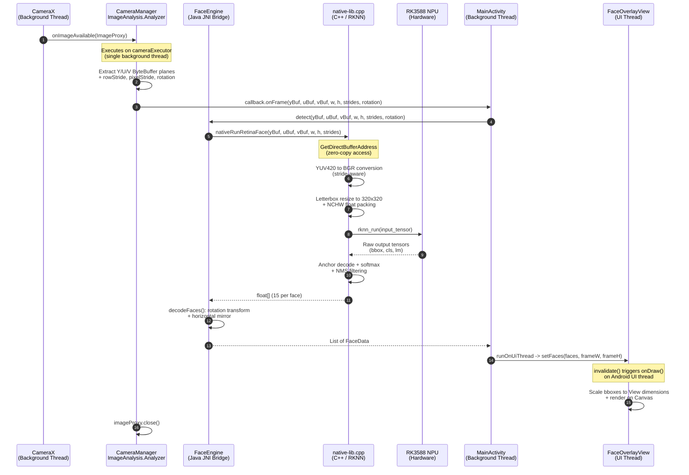

# Execution Flow

## Execution Pipeline

The runtime execution pipeline processes a single camera frame through the following discrete stages:

1. **Frame Acquisition** -- `CameraManager` configures CameraX `ImageAnalysis` with `STRATEGY_KEEP_ONLY_LATEST` backpressure. The analyzer callback executes on a dedicated single-thread `ExecutorService` (background thread). Raw YUV_420_888 plane buffers (`ByteBuffer`) are extracted from the `ImageProxy` without copy.

2. **JNI Boundary Crossing** -- `FaceEngine.detect()` forwards the three direct `ByteBuffer` references (Y, U, V) along with stride metadata to `nativeRunRetinaFace()`. The JNI layer accesses the buffers via `GetDirectBufferAddress`, achieving zero-copy transfer from Java heap to native address space.

3. **Native Preprocessing** -- Within `native-lib.cpp`, the YUV planes are converted to BGR using stride-aware row iteration. The BGR frame is letterbox-resized to the model input dimensions (320x320) and packed into NCHW float layout for RKNN consumption.

4. **NPU Inference** -- The preprocessed tensor is submitted to the RK3588 NPU via the RKNN C API (`rknn_run`). Inference executes on dedicated NPU cores with hardware-level parallelism, returning raw output tensors (bounding box regressions, classification scores, landmark offsets).

5. **Post-processing (Decode + NMS)** -- Anchor-based decoding transforms regression deltas into absolute coordinates. Softmax scoring filters candidates below the confidence threshold. Non-Maximum Suppression (NMS) eliminates redundant overlapping detections. The surviving detections are packed into a flat `float[]` array (15 floats per face: x1, y1, x2, y2, score, 10 landmark values) and returned across the JNI boundary.

6. **Rotation and Mirror Transform** -- `FaceEngine.decodeFaces()` applies coordinate rotation (0, 90, or 270 degrees) to align detections with the display orientation, followed by horizontal mirroring to correct for front-camera reflection.

7. **UI Thread Dispatch** -- `MainActivity.onCameraFrame()` invokes `runOnUiThread()` to post the decoded `List<FaceData>` and computed frame dimensions to `FaceOverlayView.setFaces()`, which triggers `invalidate()` and a subsequent `onDraw()` pass on the main thread.

## Sequence Diagram

