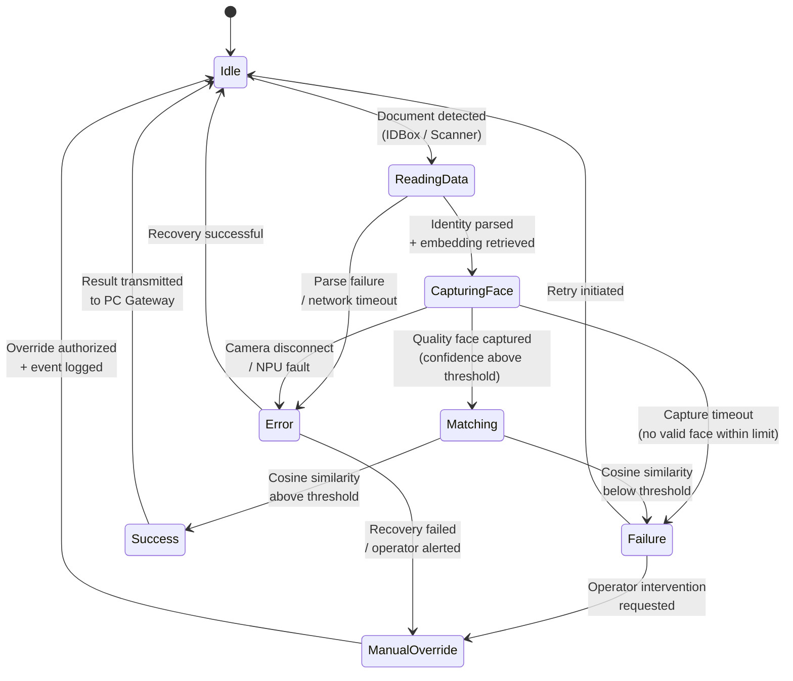

# State Machine

## Operational Logic

The application lifecycle and user interaction flow are modeled as a finite state machine. Each state represents a discrete operational phase with well-defined entry conditions, exit transitions, and fallback paths. The system is designed around a primary biometric verification workflow: document identification followed by live face capture and cosine similarity matching against a registered embedding.

### State Definitions

| State | Description |
|---|---|
| **Idle** | System powered on, camera inactive. Awaiting identity document input from USB IDBox or USB Scanner. |
| **ReadingData** | Document detected. Parsing identity fields and retrieving the registered face embedding from the Airport Server via PC Gateway. |
| **CapturingFace** | Camera active. CameraX pipeline running. RetinaFace inference executing per-frame on NPU. Awaiting a high-confidence face detection that meets quality thresholds (size, sharpness, pose). |
| **Matching** | Captured face embedding compared against the registered embedding via cosine similarity. Decision boundary applied. |
| **Success** | Similarity score exceeds the configured threshold. Verification result transmitted to PC Gateway. System returns to Idle. |
| **Failure** | Similarity score below threshold or capture timeout exceeded. Operator notification raised. |
| **ManualOverride** | Operator intervenes to authorize passage manually. Override event logged with timestamp and operator identifier. System returns to Idle. |
| **Error** | Hardware fault (camera disconnect, NPU failure, network timeout). Diagnostic information logged. Recovery attempted or operator alerted. |

## State Diagram

